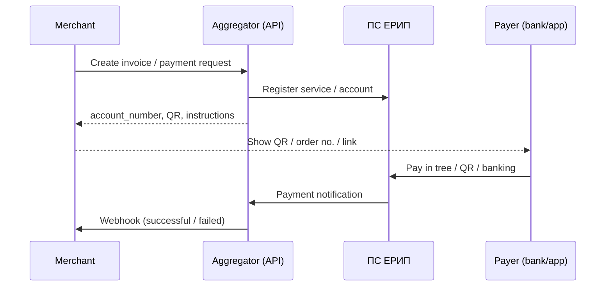

# Belarus payment APIs (including ERIP)

> Research for the `erip-mcp` project  
> Date: 2026-07-28  
> Main sources: [raschet.by](https://raschet.by/), [docs.bepaid.by](https://docs.bepaid.by/), [docs.webpay.by](https://docs.webpay.by/), [express-pay.by](https://express-pay.by/docs/api/v1), [hutkigrosh.by](https://hutkigrosh.by/), [docs.assist.ru/BEL](https://docs.assist.ru/display/BEL/API)

**Epistemic legend:** `✓` documented in a primary source · `~` reasonable synthesis · `?` unverified or may change

---

## 1. Landscape

✓ In Belarus, the local payments ecosystem centers on:

1. **ПС ЕРИП** (Unified Settlement and Information System / AIS «Расчёт») — operator: ОАО «НКФО «ЕРИП» ([raschet.by](https://raschet.by/)).
2. **Internet acquiring** (Visa, Mastercard, БЕЛКАРТ, often Mir) via local PSPs.
3. **E-POS** — invoicing/QR/link layer on top of ERIP (official published fee **1.2%**).
4. **КРОК (KROK)** — RtP payments via QR / deeplink into banking apps, operated in the ERIP ecosystem.

✓ There is no public “open” ERIP API for arbitrary developers: the official online protocol is provided under an **NDA** with НКФО ЕРИП. The usual e-commerce path is an **aggregator** with a documented REST API.

---

## 2. ERIP — system core

### 2.1 What it is

✓ ERIP lets service producers (legal entities, sole proprietors, and in some cases non-entrepreneur individuals) collect mass payments across Belarus: cash, cards, e-money, internet/mobile banking, Belpochta, info kiosks, etc.

✓ Operator since 2016: ОАО «НКФО «ЕРИП».  
✓ Scale published on raschet.by (Jul 2026): ~49,200 producers, ~82,300 services, ~2.01M payments/day.

### 2.2 Official connection modes

| Mode | Typical ERIP fee | Fee/quota | Best for | Public API |
|------|------------------|-----------|----------|------------|
| **E-POS** | 1.2% total | No | Small/medium merchants, QR, links | Via service aggregators |
| **ЕРИП.Бизнес** | 0.2–2% | 1 BV | Multi-user, more options | Portal/LK (API detail `?`) |
| **Online** | 0.2–2% | Link channel | Large issuers, real time | Protocol under NDA |
| **Offline** | 0.2–2% | Telecom operator | Meters / readings | Batch exchange |
| **Aggregators** | 0.2–2% + aggregator fee | Per PSP | Sites, CMS, SaaS | **Yes — each PSP’s REST** |

Sources: [raschet.by](https://raschet.by/), [Online](https://raschet.by/biznesu/erip/online/), [Aggregators](https://raschet.by/biznesu/erip/agregators/), [E-POS](https://raschet.by/biznesu/erip/e-pos/).

### 2.3 Direct online (no aggregator)

✓ Key requirements:

- Accept **Правила ПС ЕРИП** and the **fee schedule** (Сборник вознаграждений).
- Sign an **NDA** to obtain the **online interaction protocol**.
- Guaranteed communications channel (often via operators such as BFN).
- Software tests per protocol; individual onboarding.

~ Implication for MCP/integrators: practical value sits in aggregator APIs, not the NDA НКФО protocol.

### 2.4 E-POS

✓ Breakdown of the 1.2% fee:

- 0.7% payment acceptance organization  
- 0.2% E-POS service of НКФО ЕРИП  
- 0.3% service aggregator  

✓ Three collection modes: QR, payment link, order number in the ERIP tree.

✓ E-POS service aggregators cited on raschet.by (tariff extract list):  
ООО «Электронные системы и сервисы», ООО «ТриИнком», ООО «СейлСервиСолюшенс», ООО «Открытый контакт», ООО «Настоящая цифровая», СООО «АЙ ПЭЙ», ЗАО Банк ВТБ (Беларусь), ООО «КонсенсусЛаб», ОАО «Банковский процессинговый центр», ОАО «СтатусБанк», РУП «Издательство «Белбланкавыд», ООО «Расвиком Сервис», ООО «ИКомЧардж», ОАО «Сбер Банк», ООО «Компания электронных платежей «АССИСТ».

### 2.5 КРОК (KROK)

✓ ERIP RtP QR service for collection without a classic POS terminal.  
✓ Banks with payment apps (per bePaid docs, Jun 2026): Belarusbank, Belagroprombank, Alfa-Bank, Bank Dabrabyt, Priorbank.  
✓ Merchant settlement accounts: currently Belarusbank and Bank Dabrabyt (`?` will expand).  
✓ Merchant API: typically via a PSP (e.g. bePaid `method.type = "krok"`).  
✓ For banks: ПС «RtP QR» test stand + Swagger after request to НКФО.

---

## 3. Providers with documented APIs

### 3.1 bePaid — `docs.bepaid.by`

| Aspect | Detail |
|--------|--------|
| Role | PSP / official ERIP aggregator; Visa, MC, Belkart; Apple/Google/Samsung Pay |
| Auth | HTTP Basic (Shop ID + secret key) |
| Base | `https://api.bepaid.by` |
| Format | JSON (`Content-Type` / `Accept: application/json`) |
| ERIP | `POST /beyag/payments` with `payment_method.type: "erip"` |
| KROK | APM `type: "krok"` (transactions payments endpoint) |
| Notifications | Webhooks to `notification_url` |
| PCI | PCI DSS platform; widget/hosted form without merchant PCI |

**ERIP request types (bePaid):**

- **Single** — one charge; after `successful` it is no longer valid  
- **Permanent** — multiple charges (API only, `permanent` flag)  
- **Advance** — no prior invoice; created when ERIP payment arrives (enable with account manager)  
- **ERIP External** — merchant exposes `erip/account_verification` (JSON POST, response ≤ 14s)

**Statuses:** `pending`, `auto_created`, `permanent`, `successful`, `failed`, `expired`, `deleted`.

**Minimal ERIP example:**

```http
POST https://api.bepaid.by/beyag/payments
Authorization: Basic <shop_id:secret>
Content-Type: application/json
```

```json
{
  "request": {
    "amount": 1000,
    "currency": "BYN",
    "description": "Payment for Order#123",
    "order_id": 123456789012,
    "notification_url": "https://merchant.example.com/hooks/bepaid",
    "customer": {
      "first_name": "Ivan",
      "last_name": "Petrov",
      "country": "BY",
      "phone": "+375172000000"
    },
    "payment_method": {
      "type": "erip",
      "account_number": "123",
      "service_no": "99999999",
      "service_info": ["Payment for Order#123"]
    }
  }
}
```

✓ Response may include `erip.instruction`, `qr_code` / `qr_code_raw`, and bank deeplinks.

Docs: [ERIP overview](https://docs.bepaid.by/en/payment_methods/apms/erip/), [Create payment](https://docs.bepaid.by/en/payment_methods/apms/erip/create_payment/), [Webhooks](https://docs.bepaid.by/en/payment_methods/apms/erip/webhooks/), [KROK](https://docs.bepaid.by/en/payment_methods/apms/krok/).

---

### 3.2 WEBPAY — `docs.webpay.by` / `webpay.by`

| Aspect | Detail |
|--------|--------|
| Role | PSP / AIS «Расчёт» aggregator; acquiring + ERIP |
| Integration | JSON API and HTML form (`wsb_*` fields) |
| Test | `https://securesandbox.webpay.by` |
| Prod | `https://payment.webpay.by` |
| ERIP | Invoice flow; `wsb_tab=erip`; `wsb_due_date` (Unix ts) |
| Alternatives | FTP for invoice generation; open amounts |
| CMS | Ready-made modules |

✓ ERIP docs: payment scenarios, notifications, FTP, open amounts.  
~ Signature/seed: classic WebPay scheme with `wsb_seed` + SecretKey (verify current docs before implementing).

Docs: [ERIP](https://docs.webpay.by/en/paymentIntegration/ERIP/), [Payment script](https://docs.webpay.by/en/paymentIntegration/ERIP/ERIPPaymentScript/).

---

### 3.3 Express Payments (Express-Pay) — `express-pay.by`

| Aspect | Detail |
|--------|--------|
| Role | ERIP / E-POS aggregator + internet acquiring |
| Style | REST JSON, TLS ≥ 1.2 |
| Auth | `token` (API key) in query; optional HMAC-SHA1 signature |
| Extra | IP allowlist |
| Base | `https://api.express-pay.by/v1/` |
| Currencies | 933 BYN, 978 EUR, 840 USD, 643 RUB |

**API capabilities (ERIP / E-POS):**

- List / create / edit / get / cancel invoices (`/invoices`)  
- Invoice status (`/invoices/{id}/status`)  
- QR by invoice or personal account (`/qrcode/...`)  
- Card invoices (`/cardinvoices`), payment form, recurrencies  
- Webhooks to merchant URL  
- Sandbox + test tokens in docs  

**Invoice statuses (integers):** 1 pending, 2 expired, 3 paid, 4 partial, 5 cancelled, 6 paid by card, 7 refund.

Docs: [API v1](https://express-pay.by/docs/api/v1).

---

### 3.4 Hutki Grosh — `hutkigrosh.by`

| Aspect | Detail |
|--------|--------|
| Role | ERIP aggregator since ~2010; E-POS; CMS |
| REST base | `https://www.hutkigrosh.by/API/v1/<Subsystem>/<Method>` |
| Format | JSON or XML (`Content-Type`) |
| Auth | `POST .../Security/LogIn` → session cookie |
| Invoices | `Invoicing` subsystem |
| PDF API | [API-servisa-Hutki-Grosh.ru_.pdf](https://hutkigrosh.by/files/API-servisa-Hutki-Grosh.ru_.pdf) |
| PHP | `cmsgate-hutkigrosh-lib` |
| CMS | OpenCart, Bitrix, WooCommerce, CS-Cart, ModX, Prestashop, Tilda, … |

✓ Company linked to «Электронные системы и сервисы» (appears in E-POS listings).

---

### 3.5 Assist (АССИСТ) — `docs.belassist.by` / docs.assist.ru BEL

| Aspect | Detail |
|--------|--------|
| Role | PSP; E-POS service aggregator |
| Interface | POST form-urlencoded, SOAP, or JSON (`Format`) |
| Swagger JSON | `https://docs.belassist.by/swagger/` |
| Functions | Payment, cancel, refund, confirmation, etc. |
| TLS | Requires GlobalSign / Sectigo CAs in the trust store |

Docs: [API BEL](https://docs.assist.ru/display/BEL/API).

---

## 4. Quick comparison

| Provider | ERIP | E-POS/QR | Cards | KROK | API style | Auth |
|----------|------|----------|-------|------|-----------|------|
| **bePaid** | ✓ | ✓ (QR in response) | ✓ | ✓ | REST JSON | Basic |
| **WEBPAY** | ✓ | ✓ | ✓ | `?` | JSON + HTML form | seed/secret |
| **Express-Pay** | ✓ | ✓ QR API | ✓ | `?` | REST JSON | token + HMAC |
| **Hutki Grosh** | ✓ | ✓ | ✓ acquiring | `?` | REST + session | LogIn cookie |
| **Assist** | via E-POS | ✓ | ✓ | `?` | POST/SOAP/JSON | per contract |
| **НКФО online** | ✓ native | — | — | banks | NDA protocol | dedicated channel |

---

## 5. Typical flow (merchant → aggregator → ERIP)



---

## 6. Legal / compliance requirements (high level)

✓ Payment systems and services law: **No. 164-З of 19.04.2022**.  
✓ Current ПС ЕРИП rules (per raschet.by: from **12.01.2026**).  
✓ Sites accepting online payments must meet requirements published by ERIP (requirements page on raschet.by).  
~ PCI DSS: required for own PAN capture; most use the PSP widget/hosted form.  
? Sanctions / international PSP restrictions: Stripe/Shopify Payments do not apply natively in BY; the local stack is what matters.

---

## 7. Integration recommendations (for MCP / product)

| Use case | Suggested option |
|----------|------------------|
| BY e-commerce MVP + ERIP + cards | **bePaid** or **WEBPAY** (EN docs + CMS modules) |
| ERIP/E-POS invoices + QR only | **Express-Pay** or **Hutki Grosh** |
| Maximum control / volume protocol | Direct НКФО online (NDA + channel) |
| Instant QR pay in banking apps | **KROK** via bePaid (or another PSP that exposes it) |
| No development | E-POS / ЕРИП.Бизнес via LK |

~ For an MCP server: model resources per provider (`bepaid`, `webpay`, `express-pay`, `hutkigrosh`, `assist`) and platform-specific tools — always behind merchant credentials.

---

## 8. Reference links

### Official ERIP
- https://raschet.by/
- https://raschet.by/biznesu/erip/e-pos/
- https://raschet.by/biznesu/erip/online/
- https://raschet.by/biznesu/erip/agregators/
- https://raschet.by/documenty-operatora/ps-erip/
- https://raschet.by/krok/krok-dlya-bankov/

### Provider APIs
- https://docs.bepaid.by/en/
- https://docs.bepaid.by/en/payment_methods/apms/erip/
- https://docs.webpay.by/en/paymentIntegration/ERIP/
- https://express-pay.by/docs/api/v1
- https://hutkigrosh.by/erip/developers
- https://hutkigrosh.by/files/API-servisa-Hutki-Grosh.ru_.pdf
- https://docs.assist.ru/display/BEL/API
- https://docs.belassist.by/swagger/

---

## 9. Limits of this research

- Full lists of informational aggregators on raschet.by were not extracted as a table (dynamic/image content); use the official page when choosing a partner.
- Exact aggregator fees (beyond the ERIP band) are contractual (`?`).
- The НКФО online protocol is not public; internal endpoints are not documented here.
- KROK availability and connected banks change; check dates in PSP docs.
